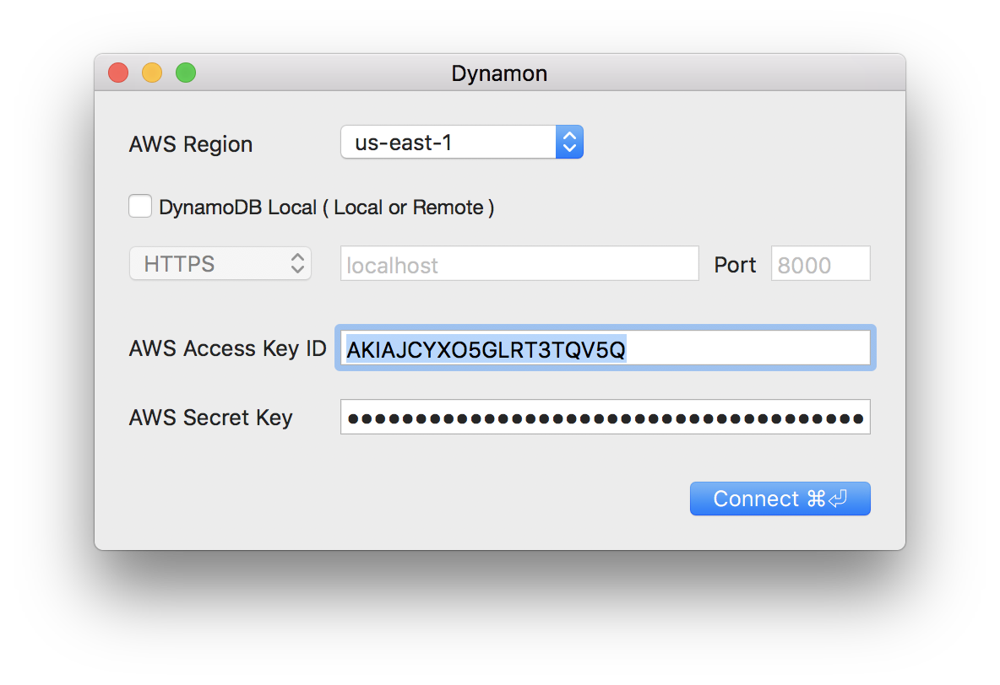
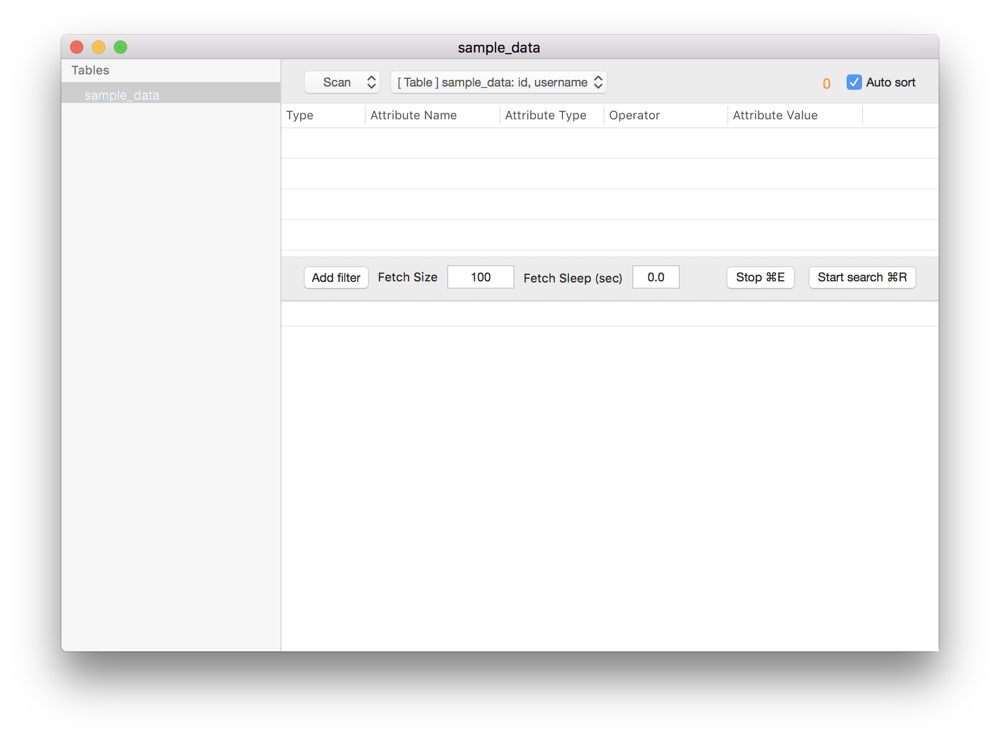
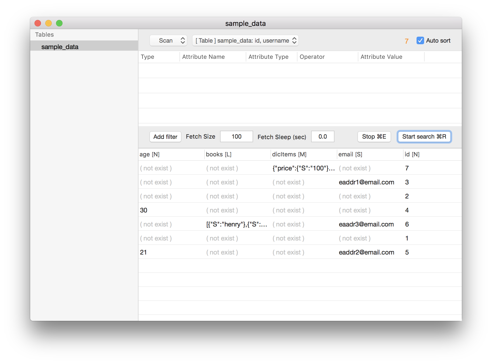
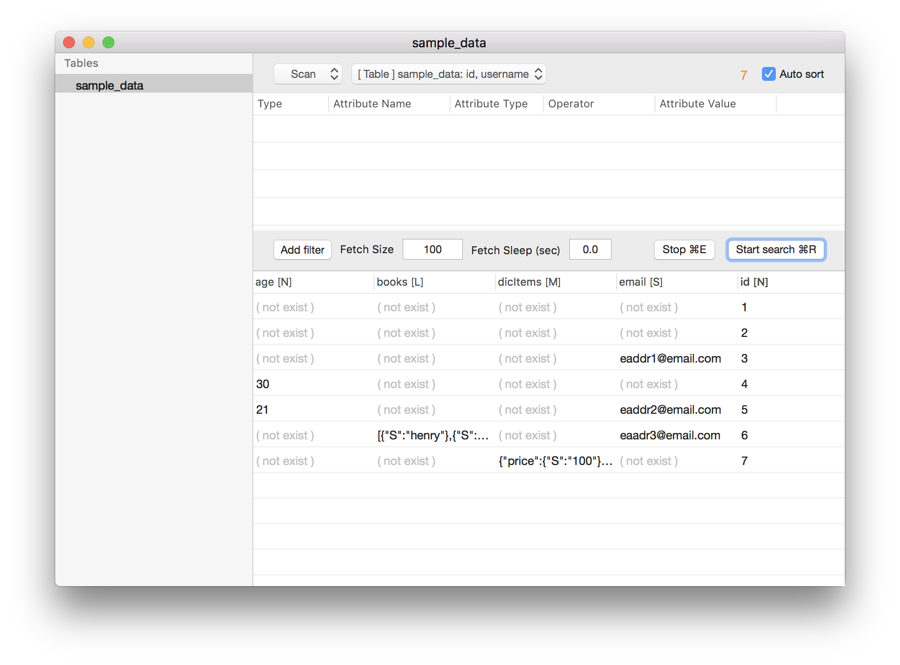
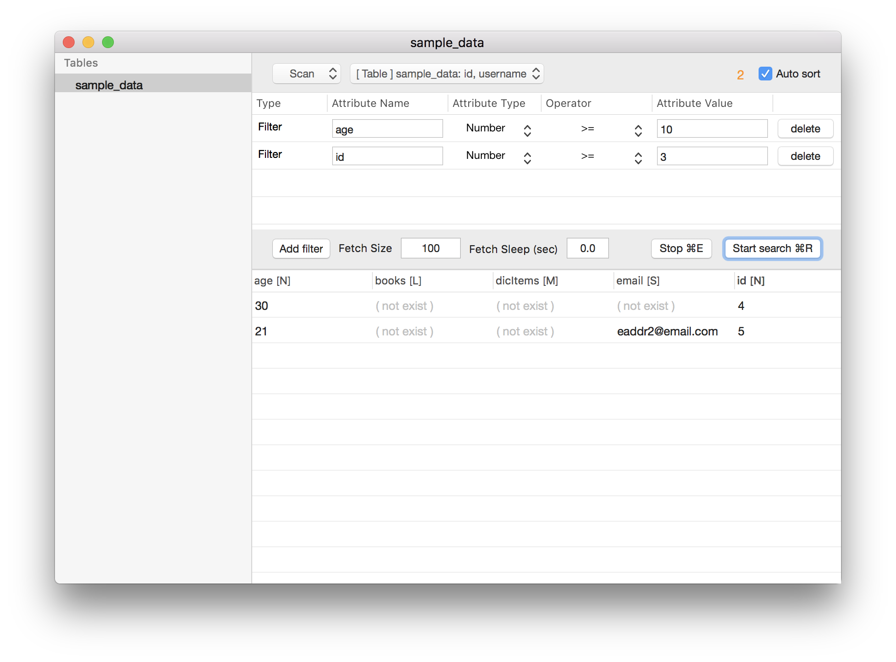
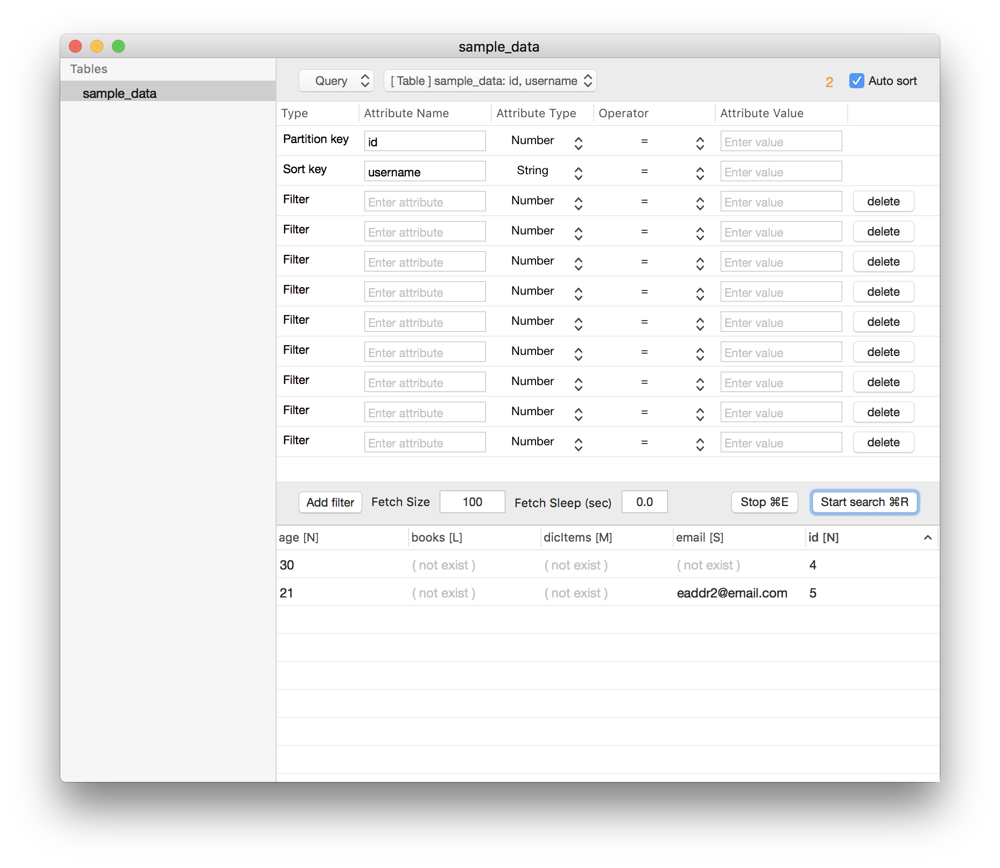
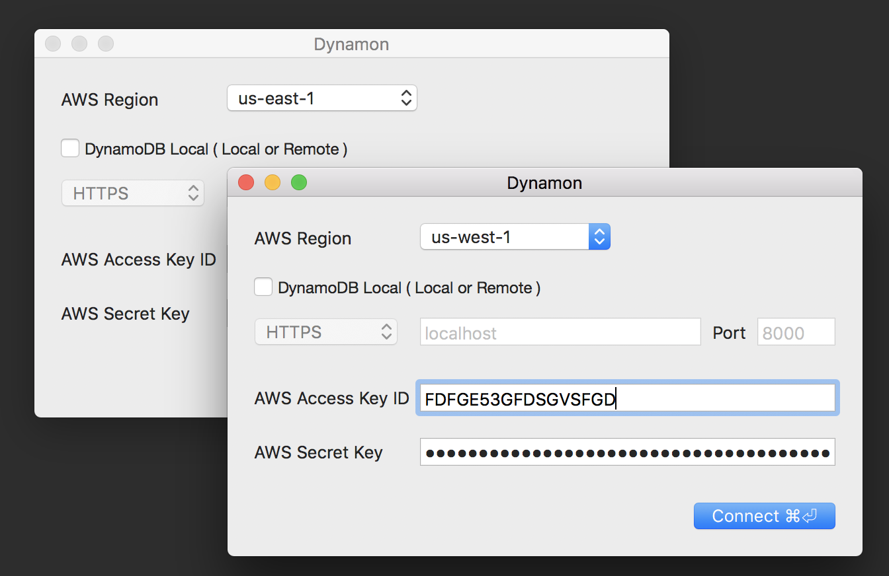
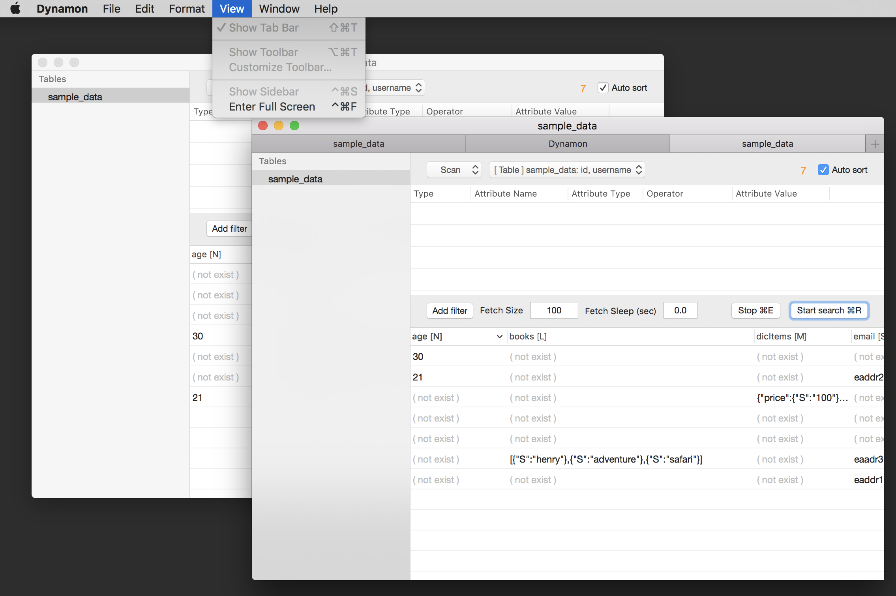
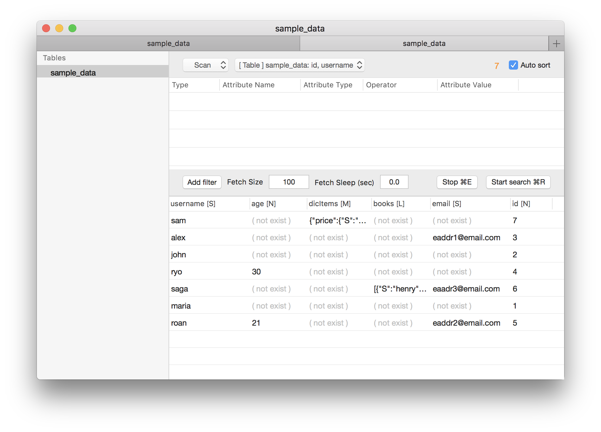

# What is dynamon
dynamon is GUI Development tools of Amazon DynamoDB

# History
Version 1.0.1  
https://github.com/touchduck/dynamon/raw/master/release/1.0.1/Dynamon-aws.zip  

# System requirements  
MacOS 10.10  
  
# Need permissions  
AmazonDynamoDBFullAccess or AmazonDynamoDBReadOnlyAccess  

# Screenshot 1
Connect to Amazon DynamoDB  
Connect to Amazon DynamoDB-local  
  

# Screenshot 2
GUI
  
  
# Screenshot 3
Fetch size, Fetch sleep, Auto Sort  
  
  
# Screenshot 4
Multiple sort  
  
  
# Screenshot 5
Scan and dynamic filter  
  
  
# Screenshot 6
Query and dynamic filter  
  

# Screenshot 7
Multiple login

# Screenshot 8
Multiple tabs

# Screenshot 9
When you run it again, Keep width and order of columns

